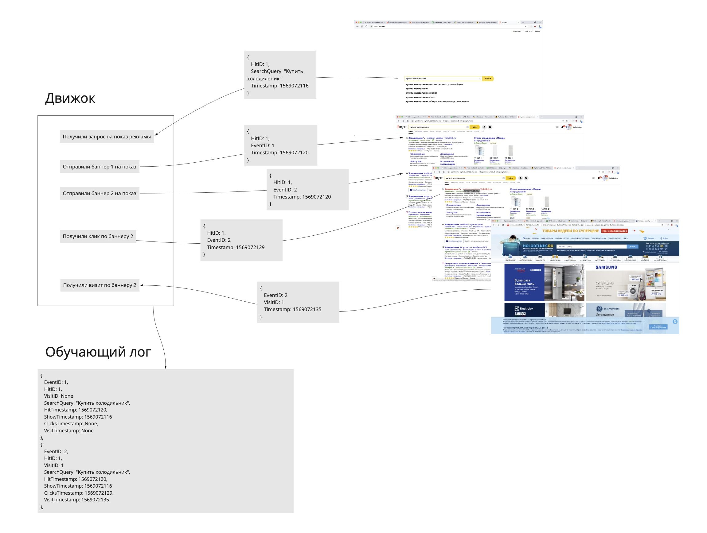

## RT JOIN

`dict` `defaultdict` `OrderedDict` `deepcopy`

### Условие

Вам нужно реализовать три функции процессинга данных `process_hit`, `process_event`, `process_visit`. 
На вход они принимают структуры хранилища, которые нужно обновлять при обработке каждого события.

В виде хранилища используются дикты. Можно пофантазировать и представить, что это не питоновские дикты, 
а некоторый внешний [key-value storage](https://en.wikipedia.org/wiki/Key-value_database) c интерфейсом дикта.

* `events_storage` — хранит результирующие евенты по ключу `EventID`. Обычный словарь.
* `hit_storage` — хранит хиты по ключу `HitID`. Нужен для нахождения хита по `HitID` из евента, если хит пришел раньше. Обычный словарь
* `event_visit_buffer` — **буффер размера 3** из `EventID` в визит. Нужен для нахождения визита по `EventID`, если визит пришел раньше. 
Используется `OrderedDict`, так как нужно удалять первый добавленный элемент при переполнении буффера и сохранить быстрое извлечение по `EventID`
* `hit_events_index` — индекс из `HitID` в список `EventID`. Нужен для нахождения евента по хиту, если евент пришел раньше. 
Используется `defaultdict`, чтоб упростить добавление в список евентов.

* все события могут приходить в любом порядке
* на выходе нужно получить все записи из `events_storage` в формате `OUTPUT_RECORD`
* не меняйте входные рекорды
* не меняйте код, который помечен "Don't change"
    
Цель этой задачи, чтобы вы потренировались взаимодействовать с большим набором хеш-таблиц сразу на примере из жизни.

### Пример

```python
>>> join([
    {"EventType": "hit", "HitID": 21, "Timestamp": 64, "SearchQuery": "Как приготовить доширак"},
    {"EventType": "show", "HitID": 21, "EventID": 29, "Timestamp": 65},
])
{"HitID": 21, "HitTimestamp": 64, "SearchQuery": "Как приготовить доширак", "EventID": 29,
"ShowTimestamp": 65, "ClickTimestamp": None, "VisitID": None, "VisitTimestamp": None},
```


### Про задачу

Это супер упрощенная схема для объединения событий, которые приходят при показе рекламы.
* Хит — это события запроса рекламы по поисковому запросу. 
* Евент — это событие показа или клика баннера. В одном хите может показываться несколько баннеров. 
Считаем, что по баннеру может быть только один клик.
* Визит — событие посещения сайта после клика. Считаем, что на один клик может быть максимум один визит.



В чем сложность такого объединения. На огромной объеме данных, которыми оперирует Яндекс, некоторые данные могут теряться,
некоторые доезжать с опозданием. Поэтому появляются дополнительные хранилища. 
Некоторые события мы не можем долго ждать, и храним в некотором лимитированном буфере. Здесь мы взяли в качестве таких событий — визиты.

Данных для обучения собирается гораздо больше, чем микро набор айдишников как в задаче. 

